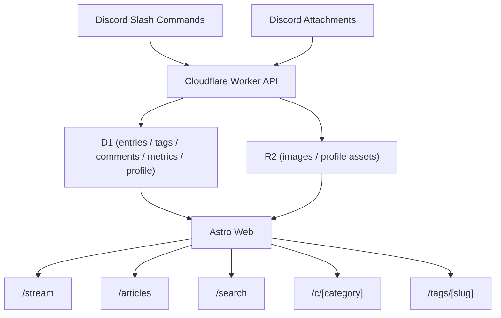

# 個人雙河道網站架構

## 產品定位

這是一個以 **Discord 為內容入口**、以 **自架網站為閱讀介面** 的個人出版系統。

核心是雙河道：

- **動態河道 / Stream**
  - 承接短內容、日常、片段、快速記錄
- **文章河道 / Articles**
  - 承接整理過的長文、評論、心得與可回頭翻找的內容

## 當前架構

## Repo 分層

- `apps/api`
  - Cloudflare Worker API
  - Discord interactions
- `apps/web`
  - Astro 閱讀站
- `packages/shared`
  - types / schema / db utilities / common utils
- `db`
  - schema / seeds / indices

## 目前資料模型

### 內容主體 `entries`

目前已存在的核心欄位：

- `entry_type`
  - `post | article`
- `category`
  - `journal | reading | travel | place`
- `status`
  - `inbox | draft | published | private | archived`
- `visibility`
  - `private | unlisted | public`
- `title`
- `content_markdown`
- `excerpt`
- `cover_asset_id`

### 補充資料

- `tags`
- `entry_tags`
- `assets`
- `entry_metrics`
- `comments`
- `user_profile`

## 目前真的已落地的內容流程

### 1. Discord 建立內容

- `/貼文`
- `/文章`
- `/旅記`
- `/書摘`

建立後會：

- 寫入 `entries`
- 自動產生 slug
- 從內容抽 `#hashtag`
- 建立 `tags` / `entry_tags`

### 2. Discord 補圖片

- `/附圖`

建立後會：

- 上傳到 R2
- 寫入 `assets`
- 第一張圖可自動成為 `cover`

### 3. 網站閱讀

前端提供：

- stream
- articles
- category archive
- tag archive
- search
- post / article detail

## 現在的技術判斷

### 這套目前適合什麼

- 單作者站
- Discord 快速發文
- 網站端閱讀與整理
- 中小型內容量

### 這套目前還不算什麼

- 完整 CMS
- 多作者平台
- 完整 public river network

## 已經開始埋的方向

目前的實作已經朝下列方向靠攏：

- tags 可聚合成主題頁
- search 已可用
- entries / assets / metrics 已有批次 API，便於列表頁擴充
- profile 已有獨立資料來源

## 下一階段規劃

以下是下一階段比較合理的演進，而不是已完成的功能：

### 內容模型升級

- `distribution_scope`
  - `local_only`
  - `public_profile`
  - `public_river`
- `post_style`
  - `text`
  - `text_with_media`
  - `gallery`
  - `quote_share`
- `assets.display_mode`
  - `cover`
  - `inline`
  - `gallery`
- `assets.caption`

### 身份與站點模型

- `site_id`
- `author_id`
- `sites`
- `authors`

### 管理後台

- `/admin`
- entry 編輯
- tags / category / visibility 編輯
- 圖片排序與顯示模式

### public feed / 公共河道骨架

- `/public/feed.json`
- `/public/posts.json`
- `/public/articles.json`

這一層目前還沒有實作。
